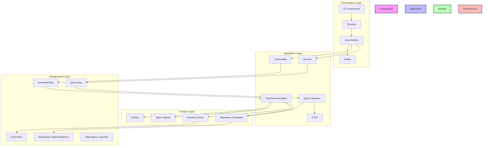
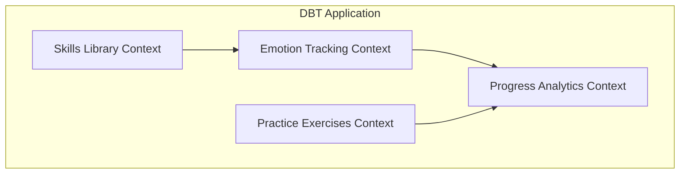
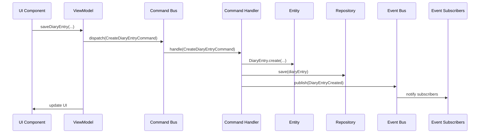
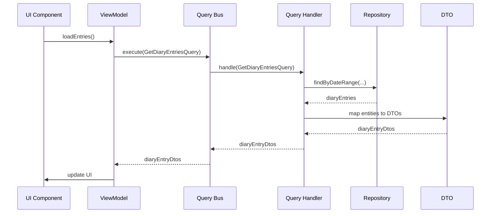

# DBT App Architecture Diagrams

## Layered Architecture



## Bounded Contexts



## Command Flow Example



## Query Flow Example



## Domain Model

```mermaid
classDiagram
    class DiaryEntry {
        +UniqueId id
        +Date date
        +Emotion[] emotions
        +Urge[] urges
        +SkillReference[] skillsUsed
        +string notes
        +addEmotion(Emotion)
        +removeEmotion(string)
        +addUrge(Urge)
        +removeUrge(string)
        +addSkillUsed(SkillReference)
        +removeSkillUsed(string)
        +updateNotes(string)
    }
    
    class Emotion {
        +string name
        +number intensity
    }
    
    class Urge {
        +string name
        +number intensity
        +boolean acted
    }
    
    class SkillReference {
        +string skillId
    }
    
    class Skill {
        +UniqueId id
        +string name
        +string description
        +string[] examples
        +string[] steps
        +updateDescription(string)
        +addExample(string)
        +removeExample(number)
        +addStep(string)
        +removeStep(number)
    }
    
    class SkillModule {
        +UniqueId id
        +string name
        +string description
        +Skill[] skills
        +updateDescription(string)
        +addSkill(Skill)
        +removeSkill(UniqueId)
        +getSkillById(UniqueId)
    }
    
    class Exercise {
        +UniqueId id
        +string title
        +string description
        +string category
        +string duration
        +string difficulty
        +ExerciseStep[] steps
        +updateDescription(string)
        +updateDifficulty(string)
        +addStep(ExerciseStep)
        +removeStep(number)
        +updateStep(number, ExerciseStep)
    }
    
    class ExerciseStep {
        +string instruction
        +string details
    }
    
    class Achievement {
        +UniqueId id
        +string title
        +string description
        +Date date
        +string icon
        +boolean completed
        +complete()
        +updateDescription(string)
        +updateIcon(string)
    }
    
    DiaryEntry "1" *-- "many" Emotion
    DiaryEntry "1" *-- "many" Urge
    DiaryEntry "1" *-- "many" SkillReference
    SkillModule "1" *-- "many" Skill
    Exercise "1" *-- "many" ExerciseStep
    SkillReference "many" --> "1" Skill
